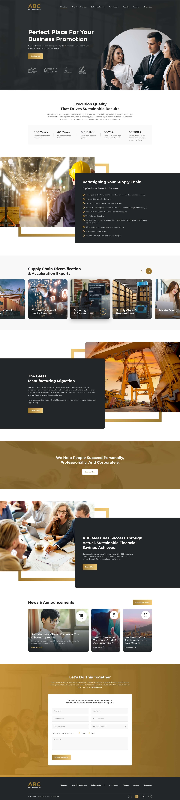

<h1> Page consulting group</h1>
<a href="https://lenosta25.github.io/page_consulting_group/">Visit Now 🚀</a>
<h3>Implemented 💻:</h3>
<ul>
  <li>link underline animation, which depends on cursor pointing position;</li>
  <li>automatic counter during scrolling of the page;</li>
  <li>slider implemented using: swiper js;</li>
  <li>data loading for the slider from JSON file;</li>
  <li>expandable cards by clicking;</li>
  <li>form validation with regular expressions;</li>
  <li>animated text applied for element on focus (In registration form).</li>
 </ul>
<h3>Tech Stack 🛠:</h3>

  </img>
  </img>
  </img>
  </img>
 

<h3>Sneak Peek of the Site 🤗:</h3>

